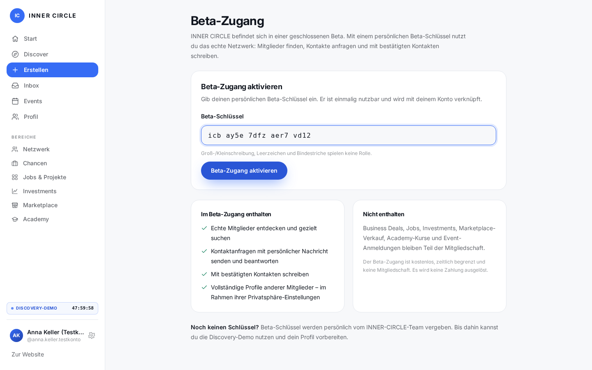
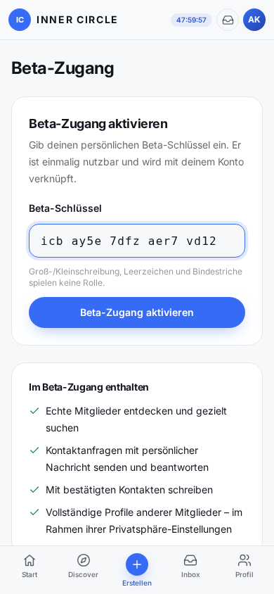
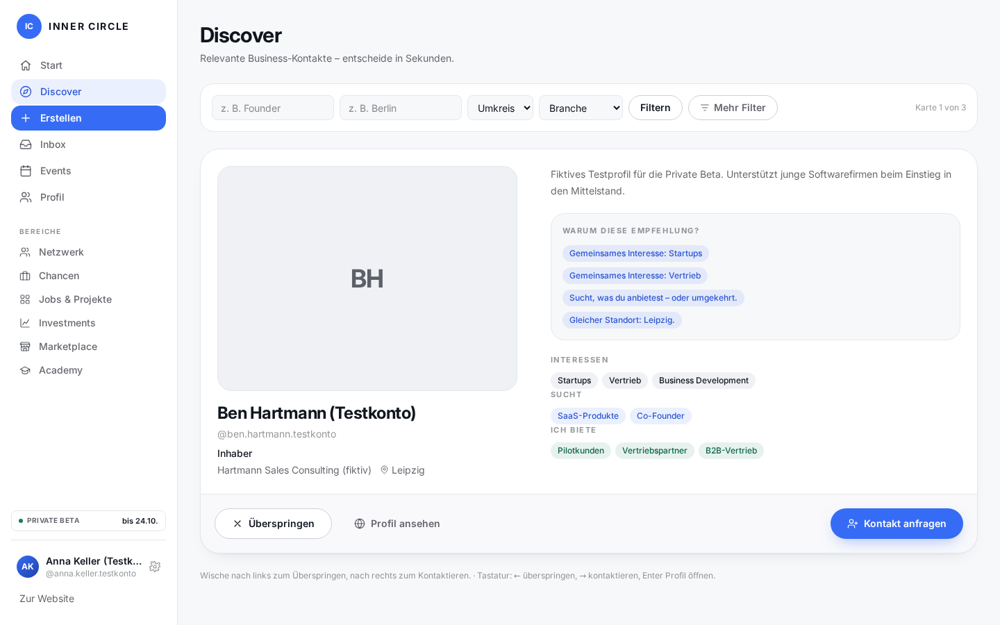
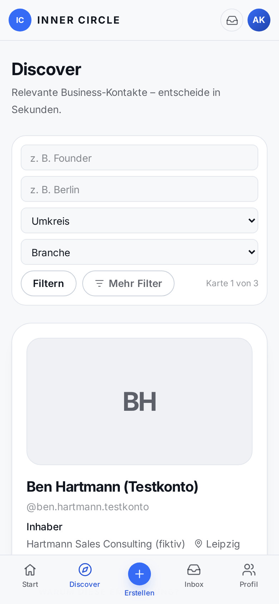
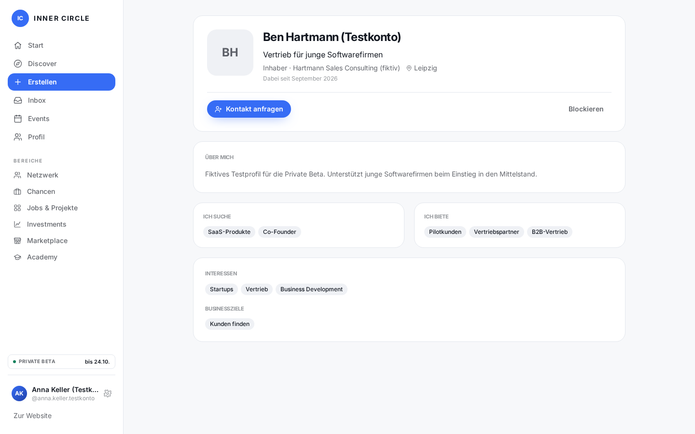
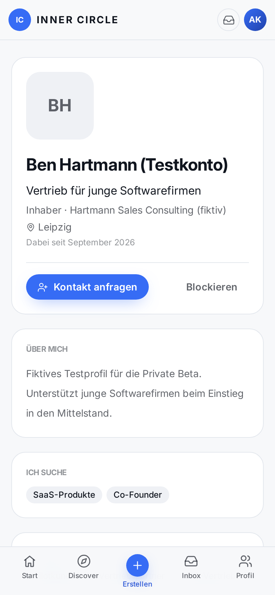
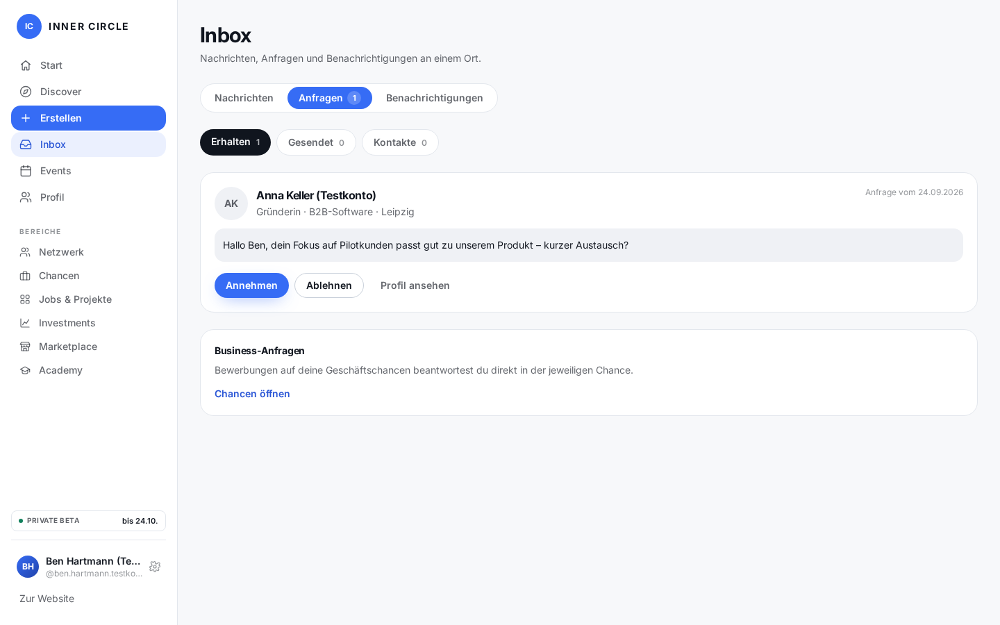
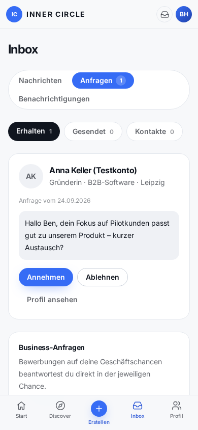
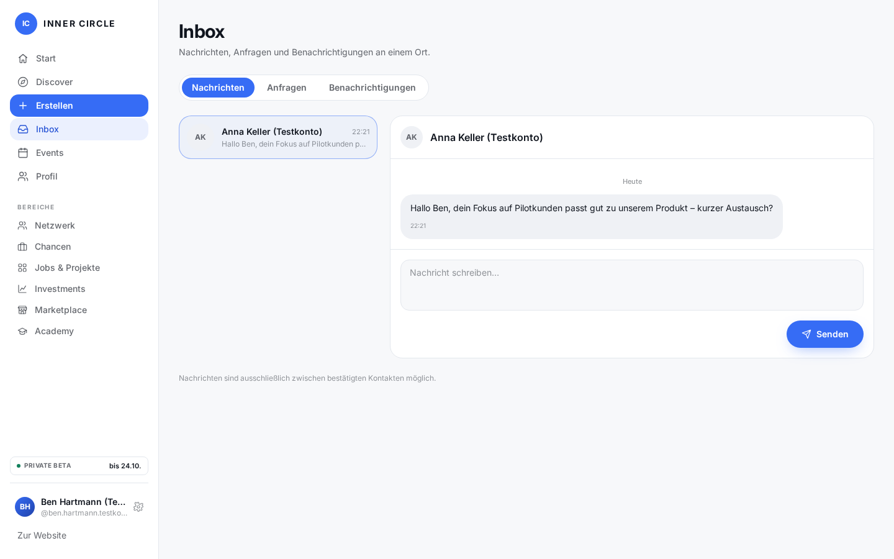
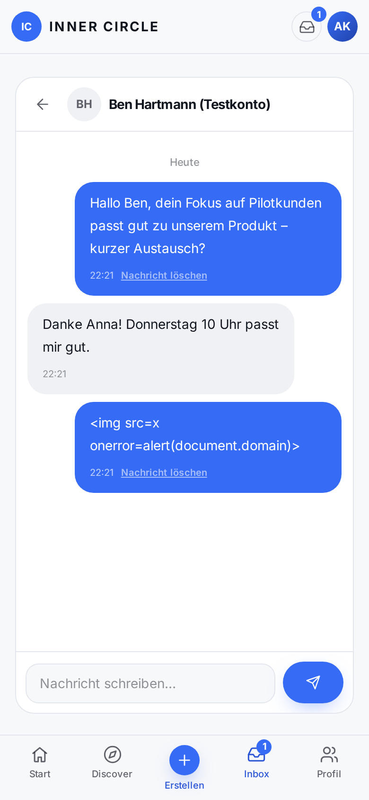

# Sprint 12 – echte Worker-Screenshots

Aufgenommen im Abschlusslauf `1790281164922` (82/82 Checks), 24.09.2026.
Keine Mockups: OpenNext-Worker in workerd mit lokaler D1, nur fiktive Testkonten.
Desktop 1440×900, Mobile 390×844 CSS-Pixel. Mobile Key/Anfrage per Viewportwechsel,
Profil/Discover/Chat in eigenem mobilen Browserkontext.
Die abgebildeten Beta-Keys gehören nur zur lokalen Testdatenbank und wurden eingelöst.

[Abschlussbericht](../../docs/SPRINT-12-FINAL-REPORT.md) · [Einzelergebnisse](e2e-results-final.json) · [Technische Logs](checks/)

## Beta-Key

[Desktop öffnen](03-beta-key-redemption.png) · [Mobile öffnen](03d-beta-key-mobile.png)

## Discover

[Desktop öffnen](01-network-discover-desktop.png) · [Mobile öffnen](02-network-discover-mobile.png)

## Mitgliederprofil

[Desktop öffnen](04-real-member-profile.png) · [Mobile öffnen](04c-real-member-profile-mobile.png)

## Kontaktanfrage

[Desktop öffnen](05-incoming-request.png) · [Mobile öffnen](05b-incoming-request-mobile.png)

## Chat

[Desktop öffnen](06-chat-after-accept.png) · [Mobile öffnen](06b-chat-mobile.png)

## Weitere Zustände

- [01b-network-directory-desktop](01b-network-directory-desktop.png)
- [01c-discover-filter-goal-desktop](01c-discover-filter-goal-desktop.png)
- [02b-network-directory-mobile](02b-network-directory-mobile.png)
- [03b-beta-welcome-profile-onboarding](03b-beta-welcome-profile-onboarding.png)
- [03c-beta-key-disabled-error](03c-beta-key-disabled-error.png)
- [04b-real-member-profile-dark-en](04b-real-member-profile-dark-en.png)
- [06c-chat-dark-en](06c-chat-dark-en.png)
- [07-discovery-demo-desktop](07-discovery-demo-desktop.png)
- [07b-dashboard-discovery-demo](07b-dashboard-discovery-demo.png)
- [07c-discovery-demo-mobile](07c-discovery-demo-mobile.png)
- [08-admin-beta-key-created](08-admin-beta-key-created.png)
- [08b-admin-beta-management](08b-admin-beta-management.png)
- [09-beta-ended-locked](09-beta-ended-locked.png)
- [09b-beta-expired-chat-readonly](09b-beta-expired-chat-readonly.png)
- [09c-beta-expired-after-demo](09c-beta-expired-after-demo.png)
- [10-dashboard-beta-desktop](10-dashboard-beta-desktop.png)
- [11-member-no-key-needed](11-member-no-key-needed.png)

Alle PNGs wurden im Abschlusslauf neu aufgenommen; bei pixelidentischem Inhalt
zeigt Git naturgemäß keine Änderung. Prüfsummen: [Manifest](screenshots-manifest.json).
Der historische Lauf `e2e-results-827861.json` bleibt zur Nachvollziehbarkeit erhalten.
