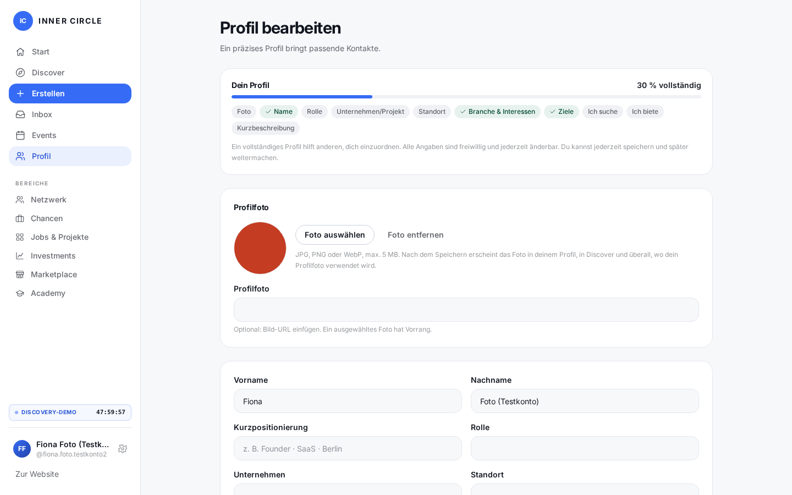
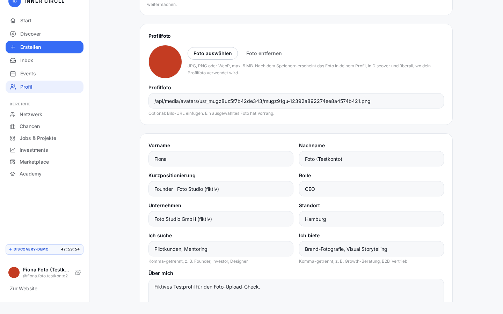
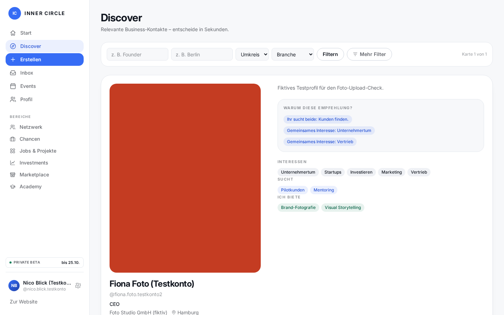

# Sprint 13 – Profil: einheitliches Speichern & Foto-Upload

Echte Worker-Screenshots des Prüfstands `1790341737664` (**39/39 Checks**),
aufgenommen am 25.09.2026 gegen `npm run cf:preview` (workerd + lokale D1 +
lokale R2-Emulation), nur gekennzeichnete Testkonten (`…@innercircle.test`,
Namen enden auf „(Testkonto)“, Unternehmen auf „(fiktiv)“).

[Einzelergebnisse](e2e-results.json) · Skript: `tests/e2e/profile-save-upload.mjs`

## Foto auswählen (Upload + Live-Vorschau)

„Foto auswählen“ öffnet Galerie/Dateiauswahl. Zu große Dateien (>5 MB) werden
schon im Browser abgelehnt; nach der Auswahl erscheint sofort eine Vorschau.
Der Speichern-Button unten speichert **alles auf der Seite in einem Vorgang**.

## Ein Erfolgsmelder für den kompletten Speichervorgang

Nach dem Speichern (`?saved=all`) bleibt der Editor geöffnet und zeigt den
Banner „Alle Änderungen gespeichert – Profilfelder, Foto, Interessen & Ziele“.
Das Foto-URL-Feld zeigt die gespeicherte Media-URL
(`/api/media/avatars/<nutzer>/<datei>.png`) – nie Base64.

## Foto in Discover (zweites, Beta-fähiges Konto)

Ein zweites Konto mit eingelöstem Beta-Schlüssel sieht das hochgeladene Foto
auf der Discover-Karte (echtes Netzwerk, keine Demo-Profile).

## Weitere Aufnahmen

| Datei | Inhalt |
| ----- | ------ |
| `01-photo-too-large-error.png` | Client-seitige Ablehnung einer >5-MB-Datei mit Fehlermeldung |
| `04-after-reload-everything-persisted.png` | Editor nach Hard-Reload: alle Felder, Interessen, Ziele und das Foto sind weiterhin gespeichert |
| `05-own-profile-with-photo.png` | Foto auf der eigenen Profilseite (`/app/people/<handle>`) |
| `06-photo-removed.png` | Nach „Foto entfernen“ + Speichern: Initialen-Avatar wieder sichtbar |
